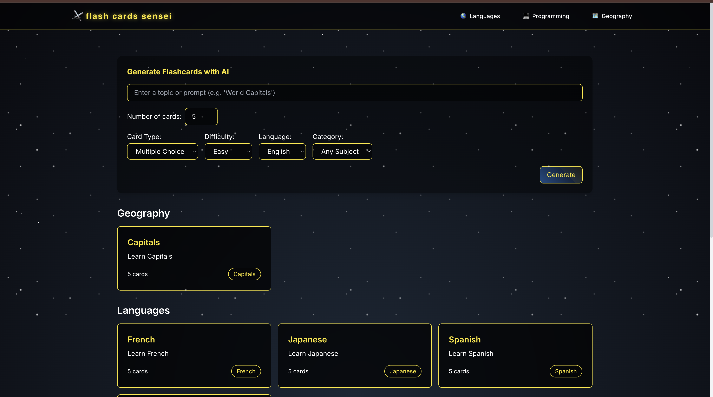

# 🚀 Flash Cards Sensei - The Force of Learning

> "Do. Or do not. There is no try." – Master Yoda

Welcome to **Flash Cards Sensei** – your interactive, AI-powered flashcard platform for mastering any topic, language, or subject. Built with Next.js 14, TypeScript, and OpenAI, this app brings the power of generative AI and beautiful UI/UX to your learning journey.

---

## 🚀 Features

### ✨ AI-Powered Flashcard Generator
- **Instantly generate custom flashcard decks** on any topic using OpenAI.
- **Full customization:**
  - **Number of cards:** Choose how many cards to generate (default: 5).
  - **Card Type:** Multiple Choice, True/False, or Fill in the Blank.
  - **Difficulty:** Easy, Medium, or Hard.
  - **Language:** English, Spanish, or French.
  - **Category/Subject:** Any Subject, Geography, Science, History, Math, or Literature.
- **Interactive Decks:** Play through generated cards with answer selection, navigation, and animated feedback.
- **Game Stats:** Track your score, accuracy, and completed cards for every AI-generated deck.

#### Example: Customization UI



*Above: The AI-powered flashcard generator with options for number of cards, card type, difficulty, language, and category.*

Try it live: [https://flash-card-sensei-git-main-santhosh-thiyagarajans-projects.vercel.app/](https://flash-card-sensei-git-main-santhosh-thiyagarajans-projects.vercel.app/)

---

### 🧑‍🎓 Classic & AI Decks
- **Built-in decks:** Geography, Languages, Programming, and more.
- **AI decks:** Instantly create new decks on any topic, with your chosen settings.
- **Interactive experience:** Animated cards, answer feedback, and smooth navigation.

### 📊 Game Stats & Achievements
- **Score:** Earn points for correct answers.
- **Accuracy:** See your percentage of correct answers.
- **Cards Completed:** Track your progress through each deck.

---

## 🛠️ Tech Stack
- **Framework:** Next.js 14 (App Router, Suspense, Edge API routes)
- **Language:** TypeScript
- **Styling:** Tailwind CSS
- **Animation:** Framer Motion
- **AI:** OpenAI GPT-3.5 Turbo

---

## 🚦 Getting Started

1. **Clone the repo:**
   ```bash
   git clone <repo-url>
   cd flash-cards-sensei
   ```
2. **Install dependencies:**
   ```bash
   npm install
   ```
3. **Add your OpenAI API key:**
   - Create a `.env.local` file:
     ```env
     OPENAI_API_KEY=sk-...
     ```
4. **Run the dev server:**
   ```bash
   npm run dev
   ```
5. **Open [http://localhost:3000](http://localhost:3000) in your browser.**

---

## 📦 Deployment
- **Production-ready:** Deploy to Vercel or your favorite platform.
- **Next.js 14 compliant:** Uses Suspense boundaries and client/server component best practices.

---

## 📞 Contact & Feedback
- Open an issue or PR for questions, suggestions, or contributions.

> "The greatest teacher, failure is." – Master Yoda

May the Force of learning be with you! 🌟